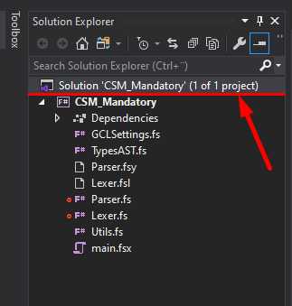
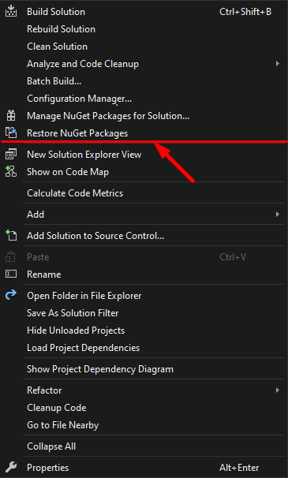

# Basic Project Setup for CSM Assignment
## The problem
1) At some point in the past there have been made updates to how NuGet downloads and handles packages. Depending on how you set up your Visual Studio environment, NuGet's default package management format will be one of either "PackageReference" or "Packages.config". The latter automatically places NuGet packages in the solution directory, the former places them in your user folder (specifically "%HOMEPATH%\\.nuget\\").
2) The 2.5 years old version of FsLexYacc (i.e. 7.0.6) was made to target .NET Framework (up to version 4.8), but not .NET Core. Most people nowadays are probably using .NET Core 3.1. The newest version (as of this writing: 10.0.0) was build to target .NET Core applications.

## The solution
1) Through the use of a nuget.config file, placed in the solution directory, you can force NuGet to place packages at a path of your choosing.
2) Simply just update FsLexYacc to the newer version.

## What you should do
1) Clone the repository to your PC and open the solution in Visual Studio.
2) In the Solution Explorer, right-click the solution.

3) Click on 'Restore NuGet Packages'. This will download the required files (e.g. FsLexYacc) to the repository defined in the above-mentioned nuget.config file. Simply building the solution should also work.
   

4) Now you need to actually generate your Lexer and Parser. Right-click your solution again, then click 'Build Solution'. Linux users (or just users with Bash) can optionally run the buildCompiler.sh script located at the solution root directory.
5) Now you can finally get to work in the main.fsx file. Have fun. :)

## Final notes
A few utilities has been included in the project in the Utils.fs file. I think the ParserUtil module is generally useful to everybody. However, the CompilerUtil module might not be. If you're not interested, or you can't figure out how to use it, you can just safely delete the CompilerUtil module.
